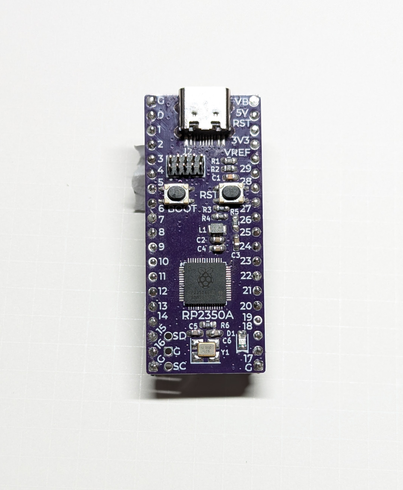
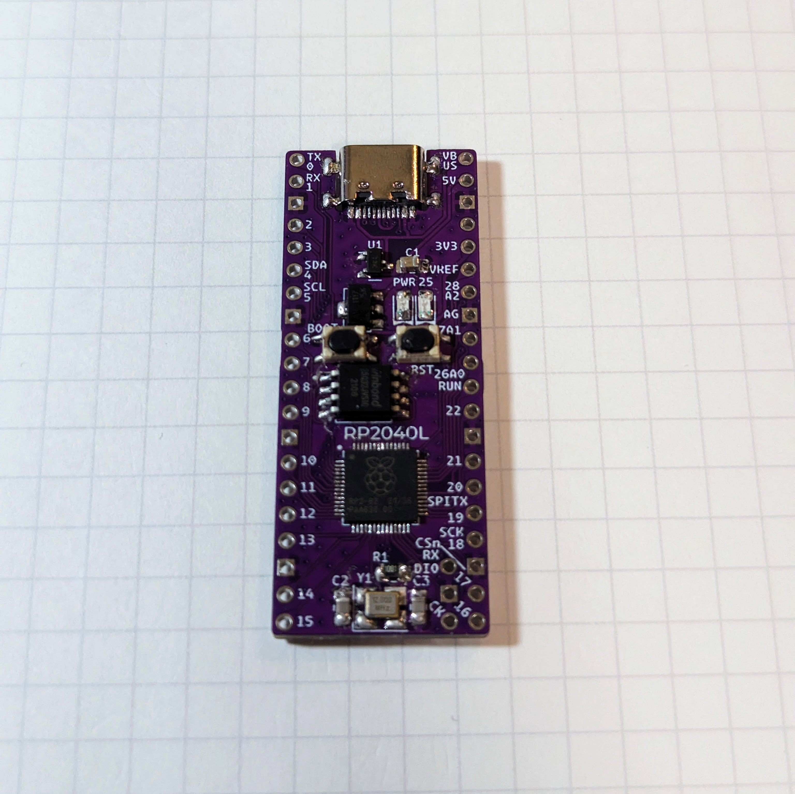
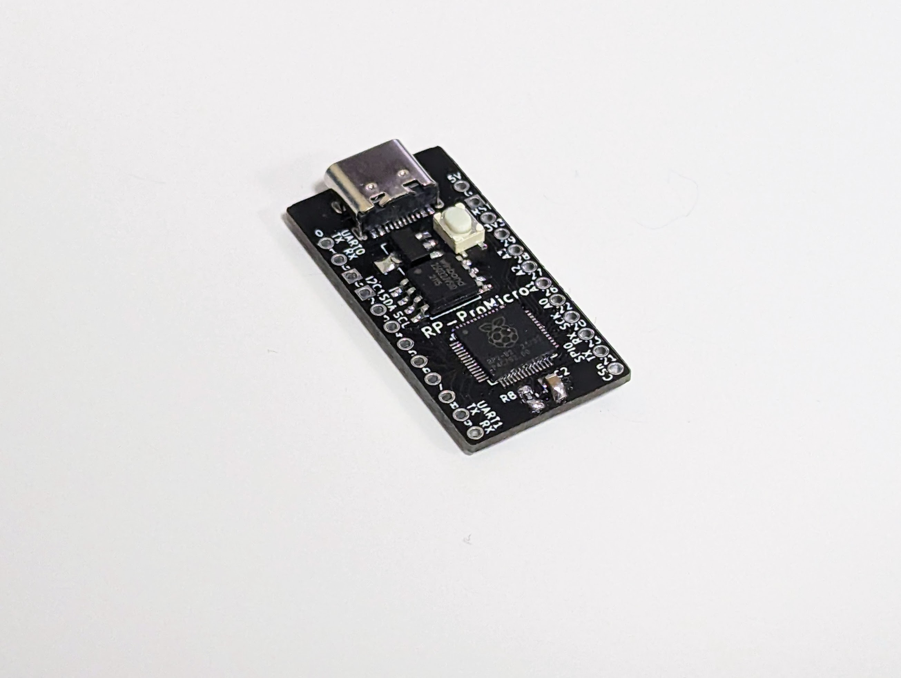

# 74th が RP2040/RP2350 を手ではんだ付けしてみたくて作った開発ボード

  

- [Raspberry PI PICO と同じピン配置で、Flush のサイズを変えたいために、作った開発ボード rp2040 large board](./rp2040-large/)
- [ProMicro ピンアウト開発ボード rp2040 pro micro](./rp2040-promicro/)
- [完成後のチェック用に使うファームウェア](rp2040-io-tester/) [rp2040-io-tester.uf2](rp2040-io-tester/rp2040-io-tester.uf2)
- [部品の調達先](./parts/)

## RP2040 手はんだ実装挑戦指南ガイド

74th の実装ノウハウをまとめたガイドを用意しています。初めて挑戦される方はぜひおよみください。

https://docs.google.com/document/d/1oHzV6qEClttqfrnbo-PlUElAemhTQe8-u3ijAKLZYF0/edit#heading=h.1b8zdysibsw9

## 使用しているシンボル、フットプリントライブラリ

https://github.com/74th/my-kicad-parts

## LICENSE

MIT
