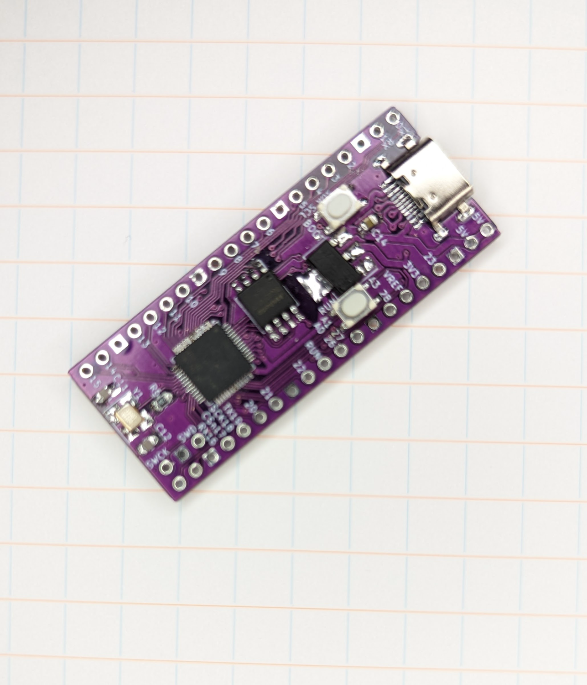
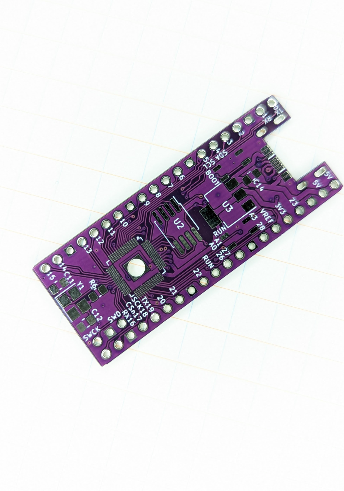
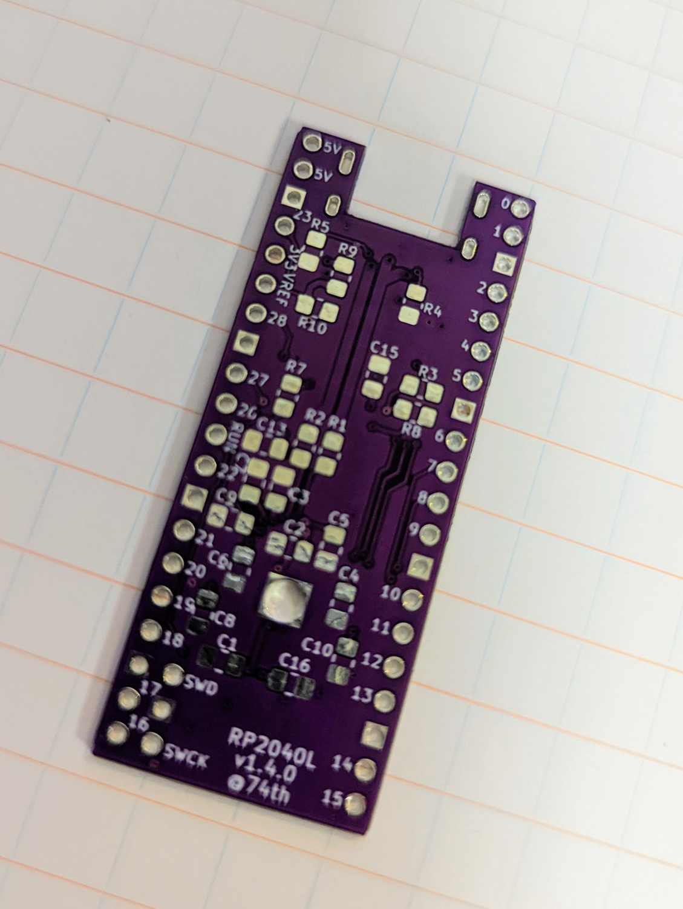
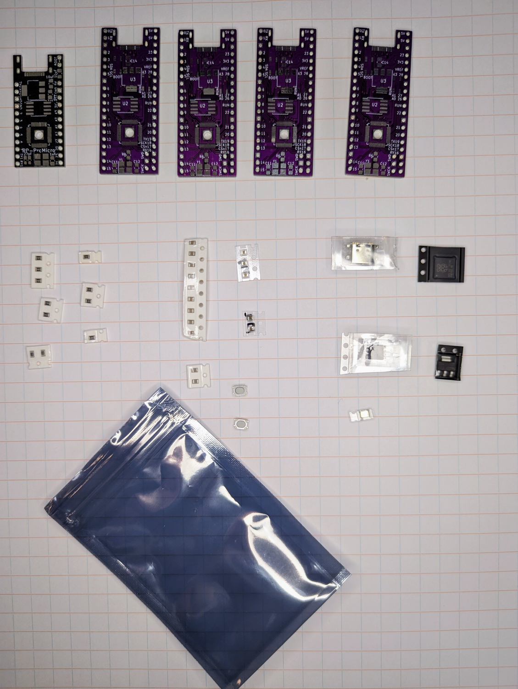

# RP2040 large board

RP2040 を手ではんだづけするのにトライしてみた開発ボードです。

Raspberry Pi PICO と同じピンレイアウトで、Flash を好きなサイズのものに置き換えて使うことができます。

RP2040 の実装の際には、細く切ったマスキングテープを使って位置合わせをしてから、実装すると成功率が上がります。

   

## v1.5.1（WIP）

- 回路図 [PDF](./rp2040-large-semantics-1.5.1.pdf) [kicanvas](https://kicanvas.org/?github=https%3A%2F%2Fgithub.com%2F74th%2Frp2040-dev-board%2Fblob%2Frp2040-large%2F1.5.1%2Frp2040-large%2Frp2040-large.kicad_sch)
- PCB [kicanvas](https://kicanvas.org/?github=https%3A%2F%2Fgithub.com%2F74th%2Frp2040-dev-board%2Fblob%2Frp2040-large%2F1.5.1%2Frp2040-large%2Frp2040-large.kicad_pcb)

### features

- USB 電源保護 IC として CH213K を追加

### BOM

| Reference           | Name                                  | Quantity |
| ------------------- | ------------------------------------- | -------- |
| C1, C4              | Capacitor 0805 10uF                   | 2        |
| C2, C3              | Capacitor 0805 27pF                   | 2        |
| C5, C7, C10         | Capacitor 0805 1uF                    | 3        |
| C6, C8, C9, C11-C16 | Capacitor 0805 100nF                  | 9        |
| D1                  | LED 0805 RED                          | 1        |
| D2                  | LED 0805 BLUE                         | 1        |
| J1                  | USB Type-C Receptacle                 | 1        |
| R1, R11             | Register 0805 1kΩ                     | 2        |
| R2, R3, R7          | Register 0805 5.1kΩ                   | 3        |
| R4, R5              | Register 0805 27.4Ω                   | 2        |
| R6, R10             | Register 0805 10kΩ                    | 2        |
| R8                  | Register 0805 1RΩ                     | 1        |
| R9                  | Register 0805 200Ω                    | 1        |
| SW1, SW2            | Button SKRPABE010                     | 2        |
| U1                  | USB Power Protection IC SOT-23 CH213K | 1        |
| U2                  | Regulator 3.3V SOT-89 AMS1117-3.3     | 1        |
| U3                  | Flash SOIC-8 W25Q32JVS                | 1        |
| U4                  | MCU Raspberry Pi RP2040               | 1        |
| Y1                  | Crystal 3225 12MHz                    | 1        |

### BOM

## v1.4.0

- 回路図 [PDF](./rp2040-large-semantics-1.4.0.pdf) [kicanvas](https://kicanvas.org/?github=https%3A%2F%2Fgithub.com%2F74th%2Frp2040-dev-board%2Fblob%2Frp2040-large%2Fv1.4.0%2Frp2040-large%2Frp2040-large.kicad_sch)
- PCB [PDF](./rp2040-large-pcb-1.4.0.pdf) [kicanvas](https://kicanvas.org/?github=https%3A%2F%2Fgithub.com%2F74th%2Frp2040-dev-board%2Fblob%2Frp2040-large%2Fv1.4.0%2Frp2040-large%2Frp2040-large.kicad_pcb)

| ID                         | package                             | Value   | Num |
| -------------------------- | ----------------------------------- | ------- | --- |
| C1,C2,C4,C6-C8,C10,C13,C16 | 0805in 2012mm SMD Capacitor         | 100nF   | 9   |
| C3,C5,C9                   | 0805in 2012mm SMD Capacitor         | 1uF     | 3   |
| C11,C12                    | 0603in 1608mm SMD Capacitor         | 27pF    | 2   |
| C14,C15                    | 0805in 2012mm SMD Capacitor         | 10uF    | 2   |
| R1,R2                      | 0805in 2012mm SMD Register          | 27.4R   | 2   |
| R3,R6                      | 0805in 2012mm SMD Register          | 1kR     | 2   |
| R7                         | 0805in 2012mm SMD Register          | 1kR(NC) | 1   |
| R4,R5                      | 0805in 2012mm SMD Register          | 5.1kR   | 2   |
| R8                         | 0805in 2012mm SMD Register          | 10kR    | 1   |
| R9                         | 0805in 2012mm SMD Register          | 200R    | 1   |
| R10                        | 0805in 2012mm SMD Register          | 1R      | 1   |
| U1                         | RP2040                              |         | 1   |
| U2                         | W25Q32BVSSIG                        |         | 1   |
| U3                         | AMS 1117-3.3V                       |         | 1   |
| P1                         | USB 2.0 Type-C MidMount Socket      |         | 1   |
| Y1                         | 3325mm SMD Quartz Resonator Crystal | 12MHz   | 1   |
| SW1,SW2                    | 3x4x2.5mm SMD Tactile Switch        |         | 2   |

## v1.3.1

| ID                         | package                             | Value | Num |
| -------------------------- | ----------------------------------- | ----- | --- |
| C1,C2,C4,C6-C8,C10,C13,C16 | 0805in 2012mm SMD Capacitor         | 100nF | 9   |
| C3,C5                      | 0805in 2012mm SMD Capacitor         | 1uF   | 2   |
| C11,C12                    | 0603in 1608mm SMD Capacitor         | 27pF  | 2   |
| C14,C15                    | 0805in 2012mm SMD Capacitor         | 10uF  | 2   |
| R1,R2                      | 0805in 2012mm SMD Register          | 27.4R | 2   |
| R3,R6,R7                   | 0805in 2012mm SMD Register          | 1kR   | 2   |
| R4,R5                      | 0805in 2012mm SMD Register          | 5.1kR | 2   |
| R8                         | 0805in 2012mm SMD Register          | 10kR  | 1   |
| U1                         | RP2040                              |       | 1   |
| U2                         | W25Q32BVSSIG                        |       | 1   |
| U3                         | AMS 1117-3.3V                       |       | 1   |
| P1                         | USB 2.0 Type-C MidMount Socket      |       | 1   |
| Y1                         | 3325mm SMD Quartz Resonator Crystal | 12MHz | 1   |

## 部品の購入先

[../parts/README.md](../parts/README.md)

## トラブルシューティング

(1) ルーペで、USB ソケットと、RP2040 の接続部分を拡大して、はんだがブリッジしていないか、RP2040 とランドがただしく接続できているか確認してください。

(2) GND と 5V の間の抵抗値を測り、0Ω になっていないことを確認してください

→ 0 Ω なら、USB ソケットの実装に問題がある可能性があります

USB を接続して

(3) レギュレータ AZ1117-3.3 で、GND と 5V、3.3V が計測できるか確認してください

(4) GND と RP2040 44 ピンの電圧が 3.3V になっているか確認してください

→ だめなら、USB ソケットが実装に問題がある可能性があります

(5) GND と RP2040 45 ピンでの電圧が 1.1V になっているか確認してください

→ 計測できなければ、内蔵レギュレータの入力の 44 ピンか、 出力の 46 ピンの実装に問題がある可能性があります

(6) PC で USB 接続した時に RPI-RP2 ドライブがマウントされるか確認してください

→RP2040 の クリスタルの入出力 20、21 ピンの実装に問題がある可能性があります
→RP2040 の USB DM/DP 46、47 ピンの実装に問題がある可能性があります
→ クリスタルの実装に問題がある可能性があります

(7) RPI-RP2 ドライブはマウントできるけれど、uf2 を入れても再度 RPI-RP2 がマウントされてしまう

→RP2040 の SPI Flash の 51〜56 ピンの実装に問題がある可能性があります

私のところでは、以上のトラブルシューティングでなんとかなっています。
RP2040 のはんだ付けにトライして、失敗したら一度外してやり直しても良いと思います。
