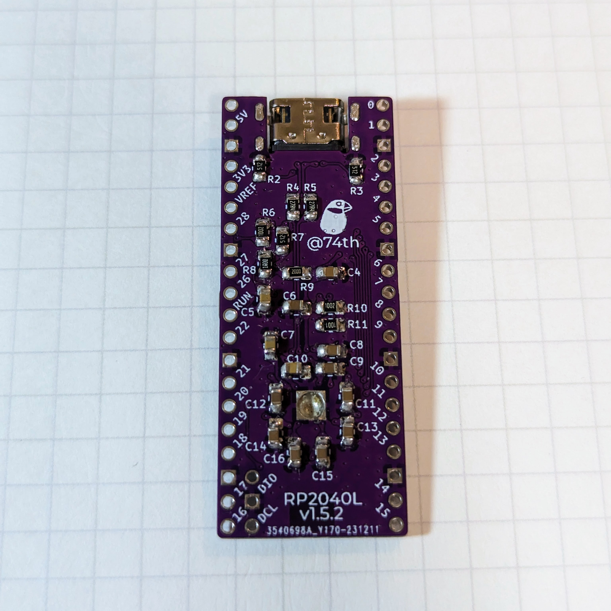
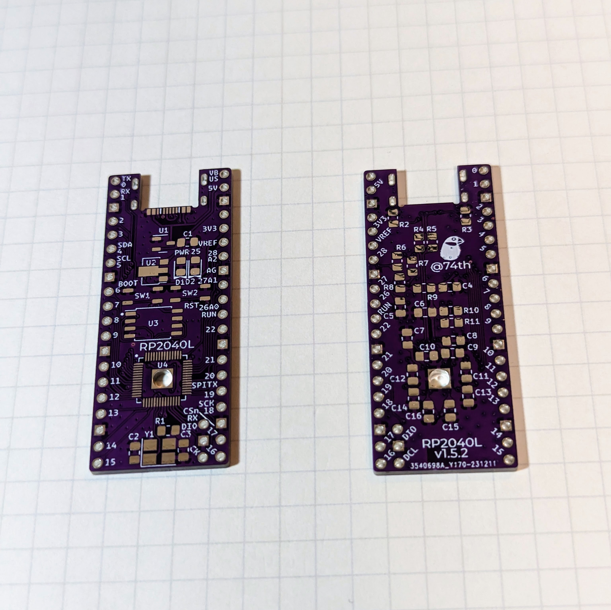

# RP2040 large board

RP2040 を手ではんだづけするのにトライしてみた開発ボードです。

Raspberry Pi PICO と同じピンレイアウトで、Flash を好きなサイズのものに置き換えて使うことができます。

付属の RP2040 位置決めマウンタを使うと、確実に正しい位置で実装を行うことができます。

BOOT スイッチはなく、ピンヘッダを実装し、ジャンパをかぶせてスイッチの代わりとします。

- [回路図](./rp2040-large-semantics.pdf)
- [PCB](./rp2040-large-pcb.pdf)

## 部品リスト

| ID                           | package                             | Value | Num |
| ---------------------------- | ----------------------------------- | ----- | --- |
| C4,C10,C2,C1,C9,C13,C7,C6,C8 | 0805in 2012mm SMD Capacitor         | 100nF | 9   |
| C5,C3                        | 0805in 2012mm SMD Capacitor         | 1uF   | 2   |
| C11,C12                      | 0603in 1608mm SMD Capacitor         | 27pF  | 2   |
| C14,C15                      | 0805in 2012mm SMD Capacitor         | 10uF  | 2   |
| R1,R2                        | 0805in 2012mm SMD Register          | 27.4R | 2   |
| R4,R5                        | 0805in 2012mm SMD Register          | 5.1kR | 2   |
| R6                           | 0805in 2012mm SMD Register          | 10kR  | 1   |
| R3,R7                        | 0805in 2012mm SMD Register          | 1kR   | 2   |
| U1                           | RP2040                              |       | 1   |
| U2                           | W25Q32BVSSIG                        |       | 1   |
| U3                           | AMS 1117-3.3V                       |       | 1   |
| P1                           | USB 2.0 Type-C MidMount Socket      |       | 1   |
| Y1                           | 3325mm SMD Quartz Resonator Crystal | 12MHz | 1   |

## 購入先

以下は 74th が利用している各部品の購入先です。
同じ規格の部品であればほかからも購入できます。

- Capacitor 0805in https://www.aliexpress.com/item/32964553793.html
- Capacitor 0603in https://www.aliexpress.com/item/32966526545.html
- Register 2012in https://www.aliexpress.com/item/32865947306.html
- RP2040 https://www.marutsu.co.jp/pc/i/2230443/
- W25Q32BVSSIG https://www.aliexpress.com/item/32727772232.html
- USB 2.0 Type-C MidMount Socket https://www.aliexpress.com/item/32998900371.html
- AMS 1117-3.3V https://www.aliexpress.com/item/4001153173532.html
- 3225mm SMD Quartz Resonator Crystal https://www.aliexpress.com/item/1005002359133404.html
