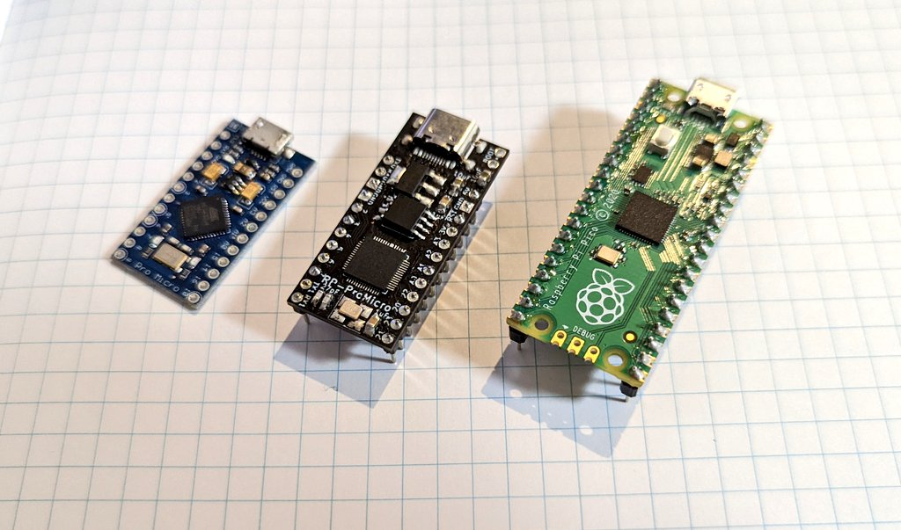

# RP2040 Pro Micro ピンアウト開発ボード

- 回路図 [./semantics.pdf](./semantics.pdf)
- PCB [./pcb.pdf](./pcb.pdf)

## 部品表

| Item | Qty | Reference(s)                         | Value             | LibPart                            | Footprint                                             | Datasheet                                                                        |
| ---- | --- | ------------------------------------ | ----------------- | ---------------------------------- | ----------------------------------------------------- | -------------------------------------------------------------------------------- |
| 1    | 9   | C1, C2, C4, C6, C7, C8, C9, C10, C13 | 100nF             | Device:C                           | rp2040-dev-board:Capacitor_0805_2012                  | ~                                                                                |
| 2    | 2   | C3, C5                               | 1uF               | Device:C                           | rp2040-dev-board:Capacitor_0805_2012                  | ~                                                                                |
| 3    | 2   | C11, C12                             | 27pF              | Device:C                           | rp2040-dev-board:Capacitor_0603_1608                  | ~                                                                                |
| 4    | 2   | C14, C15                             | 10uF              | Device:C                           | rp2040-dev-board:Capacitor_0805_2012                  | ~                                                                                |
| 5    | 1   | J2                                   | ProMicro-LeftPin  | rp2040-dev-board:ProMicro-LeftPin  | rp2040-dev-board:LeftPin                              |                                                                                  |
| 6    | 1   | J3                                   | ProMicro-RightPin | rp2040-dev-board:ProMicro-RightPin | rp2040-dev-board:RightPin                             |                                                                                  |
| 7    | 1   | P1                                   | USB2.0_C_12pin    | rp2040-dev-board:USB2.0_C_12pin    | rp2040-dev-board:USB-C-12-Pin-MidMount-ali-v2         | https://www.usb.org/sites/default/files/documents/usb_type-c.zip                 |
| 8    | 2   | R1, R2                               | 27.4R             | Device:R                           | rp2040-dev-board:Register_0805_2012                   | ~                                                                                |
| 9    | 2   | R3, R7                               | 1kR               | Device:R                           | rp2040-dev-board:Register_0805_2012                   | ~                                                                                |
| 10   | 2   | R4, R5                               | 5.1kR             | Device:R                           | rp2040-dev-board:Register_0805_2012                   | ~                                                                                |
| 11   | 1   | R6                                   | 10kR              | Device:R                           | rp2040-dev-board:Register_0805_2012                   | ~                                                                                |
| 12   | 1   | SW1                                  | SW_Push           | Switch:SW_Push                     | rp2040-dev-board:BOOT                                 | ~                                                                                |
| 13   | 1   | U1                                   | RP2040            | rp2040-dev-board:RP2040            | rp2040-dev-board:RP2040_hand                          |                                                                                  |
| 14   | 1   | U2                                   | W25Q128JVS        | Memory_Flash:W25Q128JVS            | rp2040-dev-board:W25Q16-128JV-SOIC                    | http://www.winbond.com/resource-files/w25q128jv_dtr%20revc%2003272018%20plus.pdf |
| 15   | 1   | U3                                   | AZ1117-3.3        | Regulator_Linear:AZ1117-3.3        | rp2040-dev-board:Regulator-AMS1117-SOT-223            | https://www.diodes.com/assets/Datasheets/AZ1117.pdf                              |
| 16   | 1   | Y1                                   | Crystal_GND24     | Device:Crystal_GND24               | Crystal:Crystal_SMD_3225-4Pin_3.2x2.5mm_HandSoldering | ~                                                                                |
