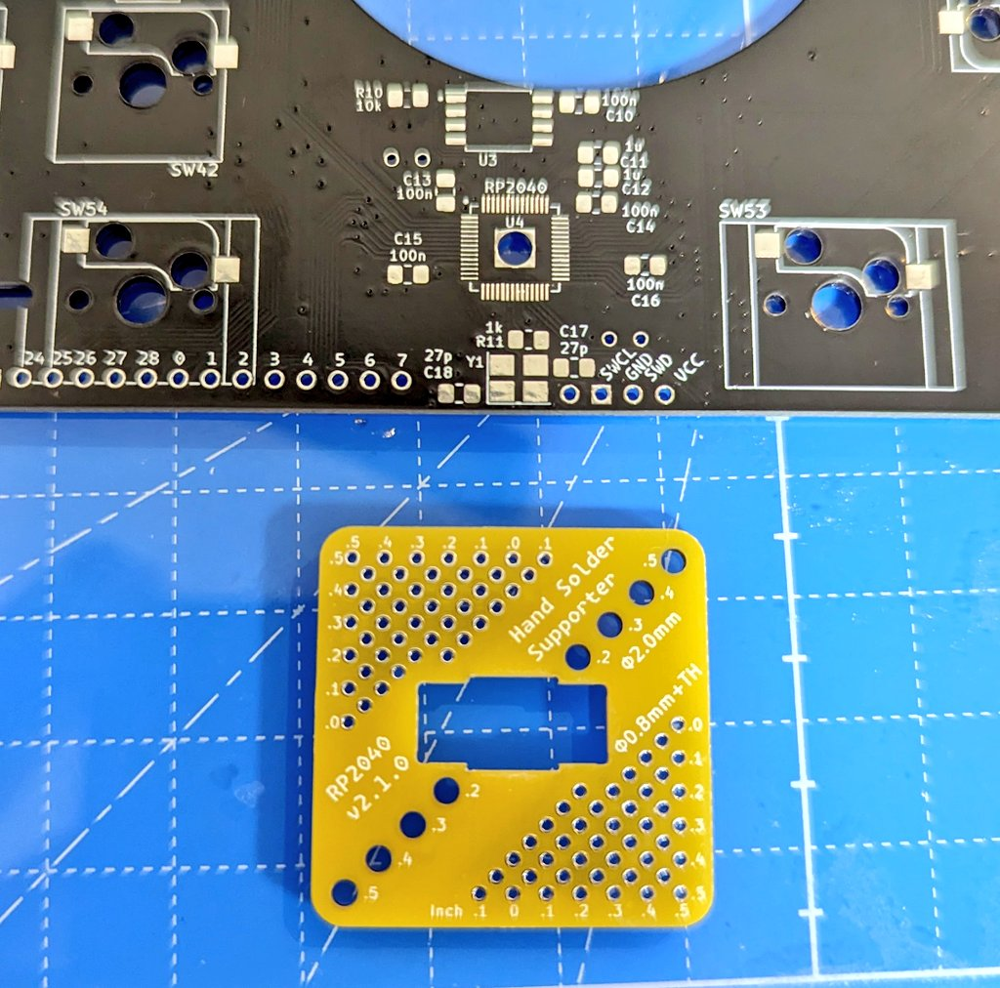
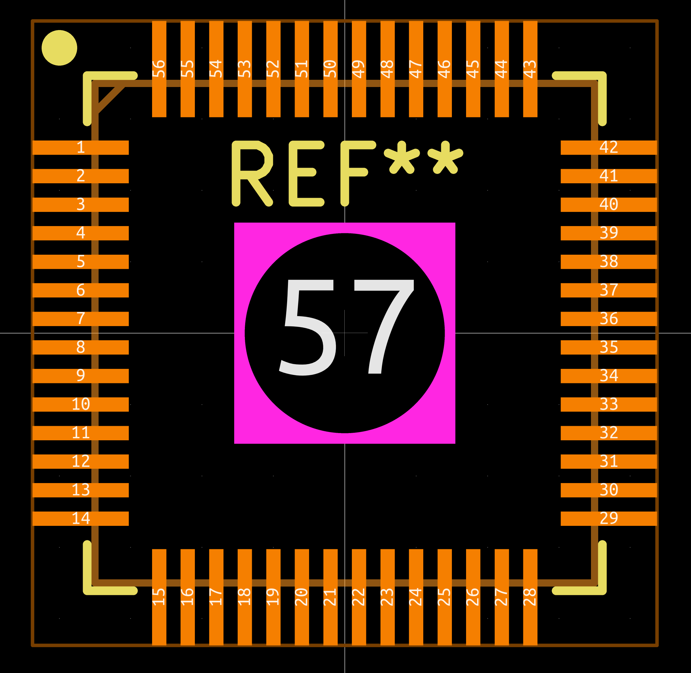
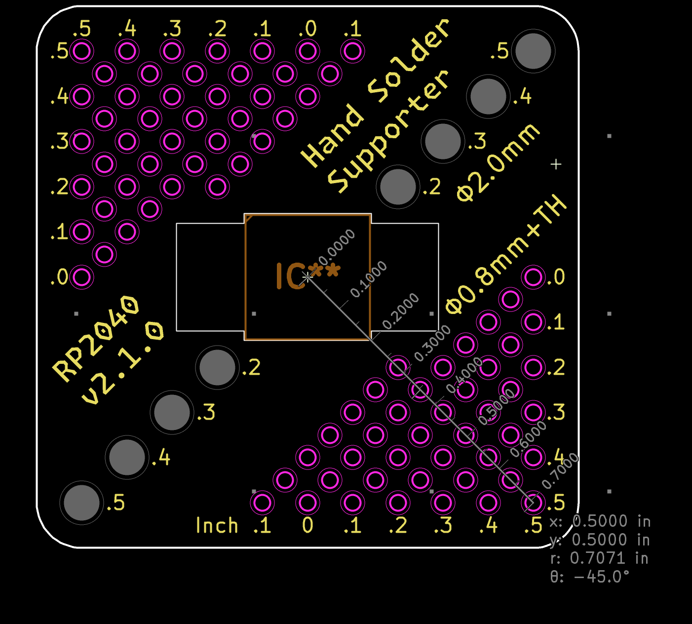
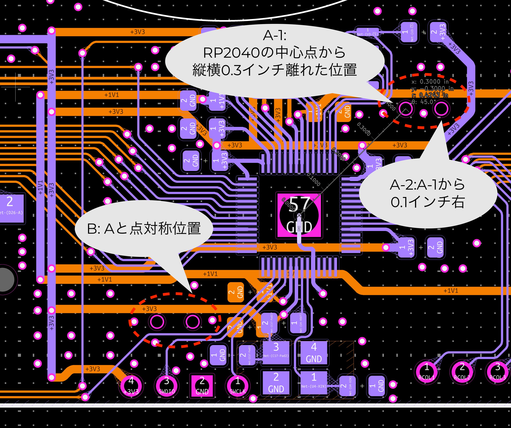
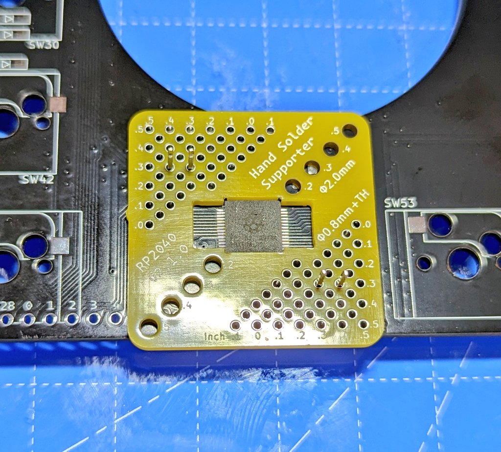
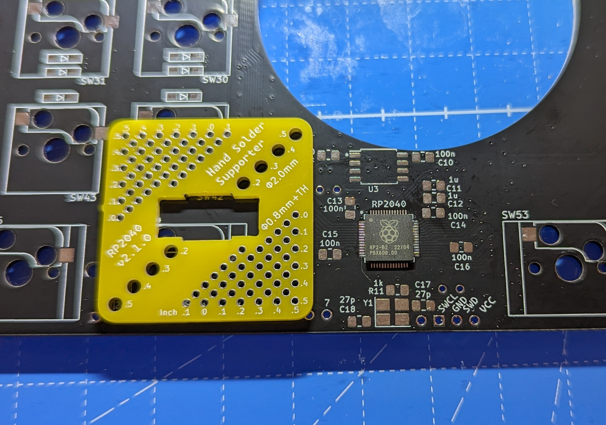

# 汎用 RP2040 手はんだ実装サポート治具

RP2040 を手はんだ実装するときに部品がずれないようにピンヘッダで固定する治具です。

この治具のおかげで、0.4mm ピッチの実装を簡単に行うことができます。

このディレクトリには、使い方の README（このファイル）と、KiCad での設計ファイルが含まれています。

## 使い方

RP2040 のフットプリントは、このリポジトリにある [rp2040-dev-board.pretty/RP2040_hand.kicad_mod](../rp2040-dev-board.pretty/RP2040_hand.kicad_mod) を使用して、裏からサーマルパッドにはんだ付けできるものを利用してください。

治具には、中心から縦、横それぞれ 0.05 インチ単位で 0.20~0.50 インチ（1.27mm 単位で 5.08mm から 12.70mm）離れたとこにピンヘッダの固定用の穴が空いています。

これらの穴を使うように、RP2040 のまわりに 4 点スルーホールを設けます。以下は 1 つの例です。

スルーホールの使用は以下のようにします。

- 穴の直径 0.8mm
- パット直径 1.0mm

実装時には 0.65mm ピンヘッダを通して配置し、RP2040 を治具にセットして、横側だけをはんだ付けします。この時にはブリッジは気にしないではんだ付けしてください。

> [!CAUTION]
> 治具を取り外す時にはかならず RP2040 を押さえつけながら行ってください。無理に外すと、治具が押さえつける力が強くて、パターンごと剥がれる場合があります。

あとは、フラックスをながしてはんだごてを当てて余分なはんだを取り除いたり、残りのピンを実装したりしてください。
