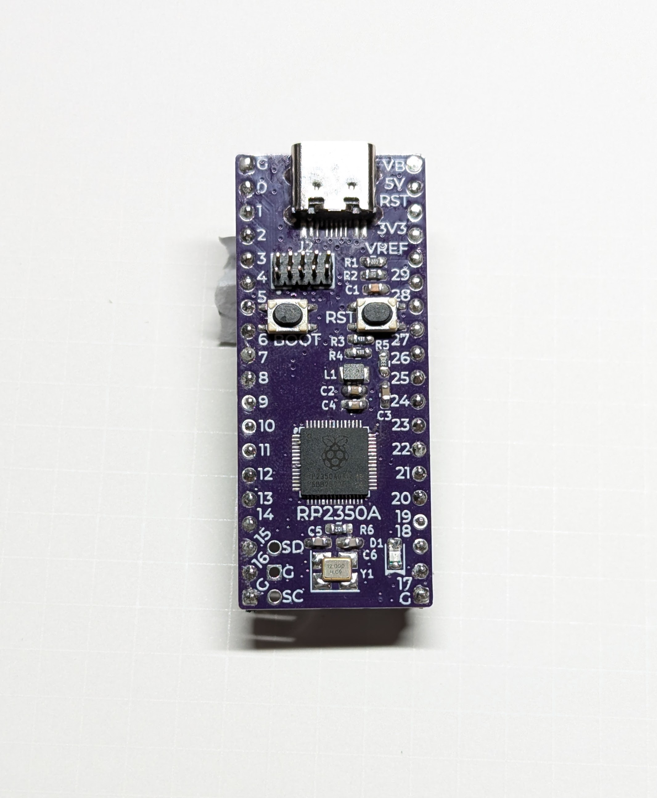

# RP2350A 手はんだ実装挑戦ボード

## v1.0.1

- 回路図 [PDF](./rp2350a-full_v1.0.1_semantics.pdf) [kicanvas](https://kicanvas.org/?github=https%3A%2F%2Fgithub.com%2F74th%2Frp2040-dev-board%2Fblob%2Frp2350-full%2F1.0.1%2Frp2350a-full%2Frp2350a-full.kicad_sch)
- PCB [kicanvas](https://kicanvas.org/?github=https%3A%2F%2Fgithub.com%2F74th%2Frp2040-dev-board%2Fblob%2Frp2350-full%2F1.0.1%2Frp2350a-full%2Frp2350a-full.kicad_pcb)

### Pin Map

### BOM

| Reference    | Name                              | Package         | Quantity |
| ------------ | --------------------------------- | --------------- | -------- |
| C1,C9-17,C19 | Capacitor 0.1uF                   | SMD I0603 M1608 | 11       |
| C2-4,C18     | Capacitor 4.7uF                   | SMD I0603 M1608 | 4        |
| C5-6         | Capacitor 7-33pF                    | SMD I0603 M1608 | 2        |
| C7-8         | Capacitor 10uF                    | SMD I0603 M1608 | 2        |
| D1           | LED Blue                          | SMD I0805 M2012 | 1        |
| J1           | USB Type-C Receptacle             |                 | 1        |
| J2           | Box Pin Header 2x5 Pitch 1.27mm   | TH              | 1        |
| L1           | Inductor 3.3uH                    | SMD I0806 M2016 | 1        |
| R1           | Resistor 200Ω                     | SMD I0603 M1608 | 1        |
| R2           | Resistor 1Ω                       | SMD I0603 M1608 | 1        |
| R3-4         | Resistor 27Ω                      | SMD I0603 M1608 | 2        |
| R5           | Resistor 33Ω                      | SMD I0603 M1608 | 1        |
| R6,R10       | Resistor 1kΩ                      | SMD I0603 M1608 | 2        |
| R7-8         | Resistor 5.1kΩ                    | SMD I0603 M1608 | 2        |
| R9,R11       | Resistor 10kΩ                     | SMD I0603 M1608 | 2        |
| SW1-2        | Button SKRPABE010                 |                 | 2        |
| U1           | MCU Raspberry Pi RP2350A          | QFN56           | 1        |
| U2           | USB Power Protection IC CH213K    | SOT-23          | 1        |
| U3           | Regulator 3.3V SOT-89 AMS1117-3.3 | SOT-90          | 1        |
| U4           | Flash W25Q32JVUU                  | USON-8          | 1        |
| Y1           | Crystal 12MHz                     | SMD 3225        | 1        |

## 実装の手順

かならずフラックスを用意してください。ブリッジした場合にはフラックスを塗って、はんだごてをあてて余分なフラックスを取り除きましょう。

以下の順序で実装することを推奨しています。

1. RP2350A(U1): RP2040 用の[位置決めボード](https://74th.booth.pm/items/5573498)を使えるなら使いましょう。手はんだ実装時のノウハウは
   https://docs.google.com/document/d/1oHzV6qEClttqfrnbo-PlUElAemhTQe8-u3ijAKLZYF0/edit#heading=h.1b8zdysibsw9 にまとめています。
2. USB Type-C: 受動部品実装前の方が、ランドを用いた疎通チェックがやりやすいため。[実装チェックツール](https://74th.booth.pm/items/5812941)を使うと便利です。
3. DCDC 用インダクタ(L1): 付近に囲むように他の部品があるため、先に実装します。
4. W25Q32VSS(U4): 裏面パッドに流すためのランドがあり、その付近に受動部品があり、後から実装が難しいため。
   - 裏面パッドのランドは他の部分より熱が伝わりにくいです。はんだが吸い込まれるまで、十分に加熱してください。
5. AMS1117-3.3(U3): 近くに CH213 があり、実装しにくいため。
6. CH213(U2)
7. 他の抵抗(R1-11)、キャパシタ(C1-19)、水晶発振器(Y1)、LED(D1)
8. スイッチ(SW1-2): サイズが大きく他の部品の実装の邪魔になるため、後から実装する

確認して実装ミスがなさそうであれば、電気的なチェックに進みましょう。

1. VBUS(VB)、5V、3V3、GND(G)間それぞれの抵抗値を計測し、短絡している（0Ω）となっている事がないことを確認する
2. USB を接続し、5V、3V3 と GND 間の電圧を測り、それぞれの電圧が正常であることを確認する
3. L1 と GND 間の電圧を測り、1.1V が出ていることを確認する。
4. PC に USB が認識されるか確認する。

全てのピンが実装できている稼働を確認するファームウェアを作っています。

各ピンが実装漏れている、若しくはブリッジしているのを確認するファームウェアを作っています。

https://github.com/74th/mcu-pin-check-firmware/

以下がファームウェアへのダイレクトリンクです。

https://github.com/74th/mcu-pin-check-firmware/raw/refs/heads/main/release/rp2350.uf2

GNDとジャンパをつなぎ、開発ボードの各スルーホールにジャンパのもう片方でタッチします。すると、USB CDCにてGPIO 8: L、GPIO 8: Hと出力されます。
これにて、全てのピンが接続され、ブリッジされていないことを確認してください。
